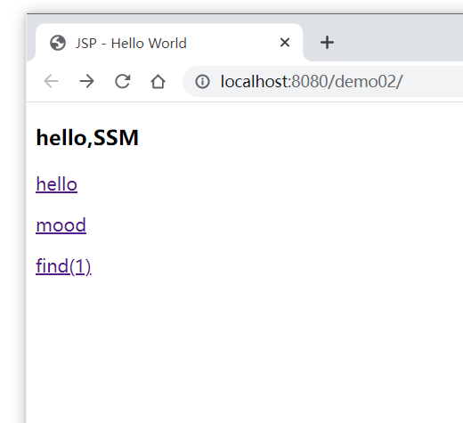
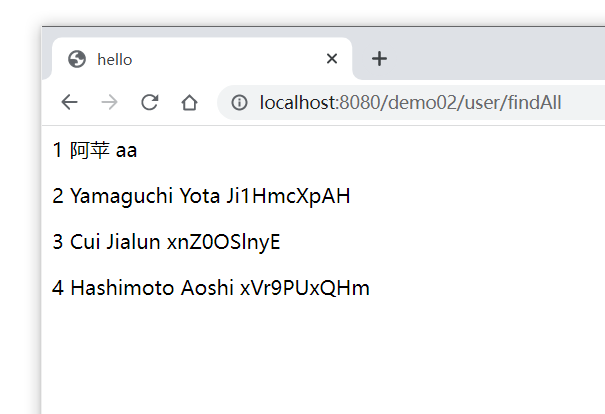
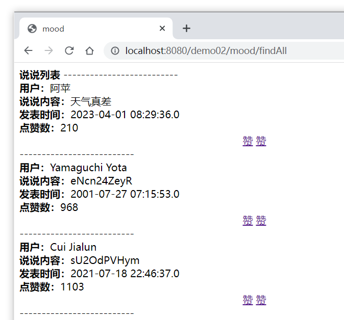
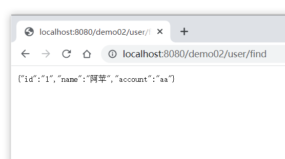
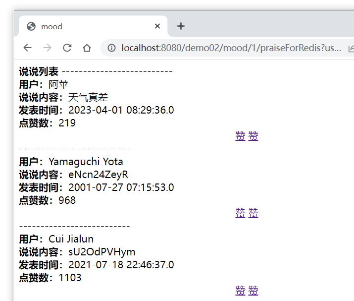
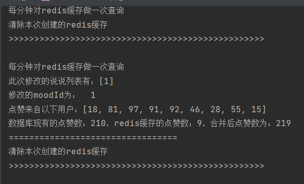

ssm_model

### 高并发点赞项目

#### 一：环境：

##### 1. SSM：

* Spring 6.0.6
* Spring MVC 5.3.24（6以上的版本需要tomcat10+） 
*  mybatis 3.5.12

考虑大规模数据处理和分布式存储引入

##### 2. NoSQL：

* redis 5.0.14

  将点赞信息缓存到内存中，然后通过定时器定期存入数据库

  

##### 3. MessageQueen：

* activeMQ 5.18.0

  主要用于实现异步功能，将不同用户的点赞信息汇集（没实现

启动redis和tomcat

#### 二：效果展示

##### 1. 初始页：

##### 2. hello（显示用户信息：

##### 3. mood（说说列表：

##### 4. find(1)（查询1号用户

##### 5.  点赞

##### 6. 控制台输出

#### 三：收获总结

相比于之前伪造的ssm项目，数据方面，引入了数据库和数据池以及Redis；前端页面，使用jstl来实现数组遍历和效果展示；重点是引入redis，算是NoSQL入门；消息队列的话没复现成功